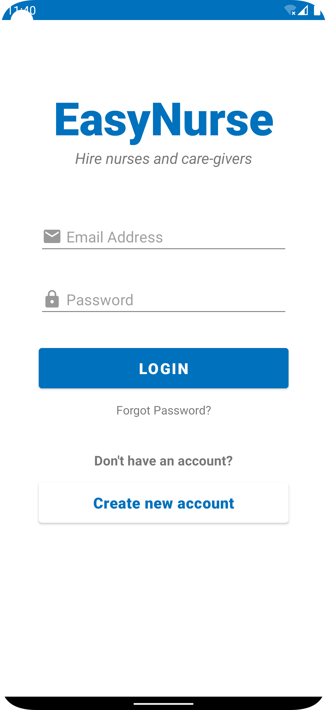
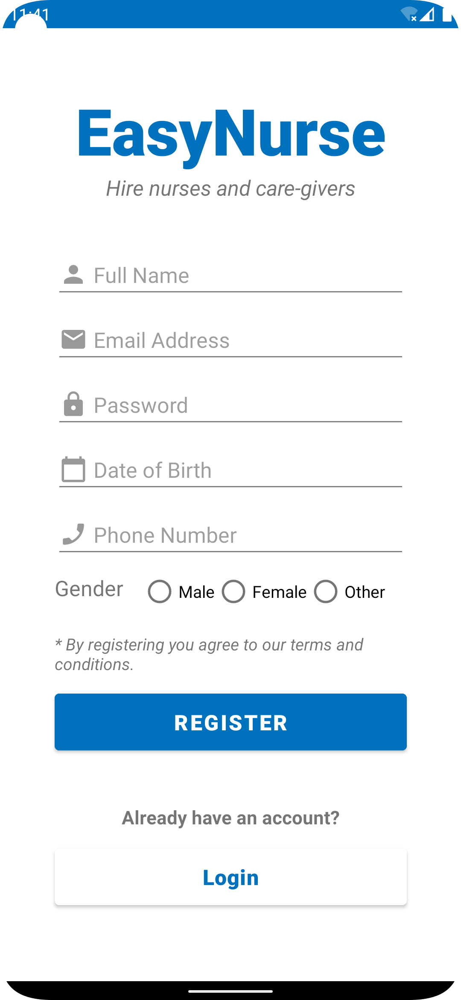
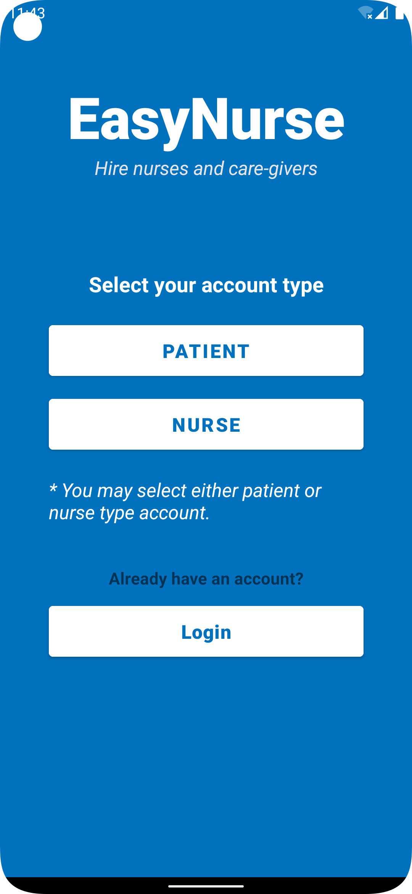
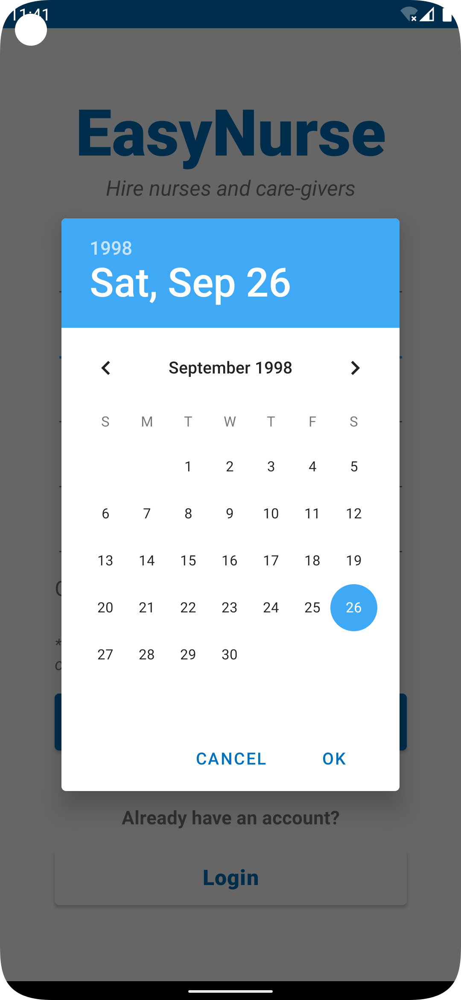
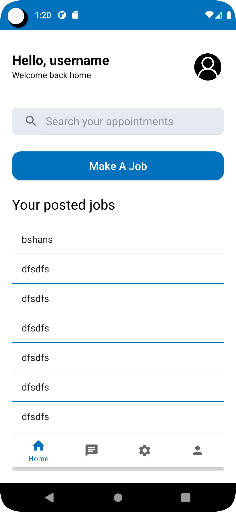
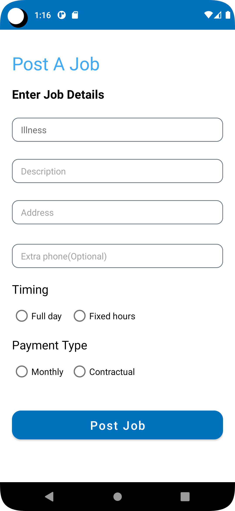

# EasyNurse
A mobile app for availing services from professional nurses and care-givers.

#### Mobile Application Development
#### CSE 4181(A) &ndash; Summer 2022 trimester

 

> Project Name: EasyNurse
> 
> Group members:
> - Ahmed Shabab Noor (011 193 024) &ndash; [@ashababnoor](https://www.github.com/ashababnoor)
> - Debopom Sutradhar (011 201 046) &ndash; [@debopom](https://www.github.com/Debopom)
> - Sudipto Mondal (011 201 184) &ndash; [@sudiptomondal25](https://www.github.com/SudiptoMondal25)

  Login View                                  | Sign Up View                                     | Account Type Selection                                        |
:--------------------------------------------:|:------------------------------------------------:|:-------------------------------------------------------------:|
 |    |    |

  Date Picker                                 | Patient Home                                     | Job Posting Form                                              |
:--------------------------------------------:|:------------------------------------------------:|:-------------------------------------------------------------:|
 |    |    |
